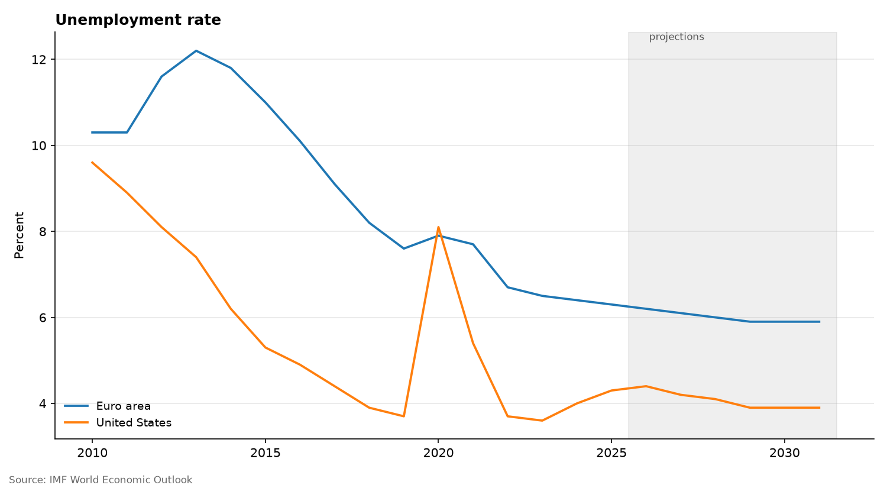

# country-data

A GitHub Copilot agent skill that fetches, tabulates and charts economic and development data
for any country or country group. It uses the free public **IMF World Economic Outlook** and
**World Bank WDI** APIs.

Ask Copilot in plain language, for example:

- "Plot inflation for the G7 since 2010"
- "GDP growth in France, Germany and the US"
- "Which emerging markets have the highest government debt?"
- "Life expectancy in Nigeria, Kenya and Ghana"

Copilot prints a table and a short summary, and saves a CSV file and a PNG chart.



*"Euro area unemployment vs the US since 2010": the shaded years are IMF projections.*

## Install

**In a repository (shared with everyone who uses Copilot there):** copy `.github/skills/country-data/`
into the repository's `.github/skills/` folder.

**Personal (Copilot CLI, every project):** copy `.github/skills/country-data/` to `~/.copilot/skills/`.

Requirements: Python 3.9+ and

```
python -m pip install -r .github/skills/country-data/scripts/requirements.txt
```

## Microsoft 365 Copilot agent (no code)

The [`m365-agent/`](m365-agent/) folder has a ready-made data file (`IMF_World_Economic_Outlook_data.xlsx`: 23 IMF
indicators for about 200 countries and IMF aggregates, 1980–2031) and step-by-step instructions to build
a Microsoft 365 Copilot agent that charts it with Code interpreter. See
[`m365-agent/AGENT_SETUP.md`](m365-agent/AGENT_SETUP.md).

## Run without Copilot

```
python .github/skills/country-data/scripts/country_data.py show --what "gdp growth" --countries "France, G7" --start 2010
python .github/skills/country-data/scripts/country_data.py --help
```

## License and credits

Released under the [MIT License](LICENSE).

Inspired by [johnsonice/RA-Skills](https://github.com/johnsonice/RA-Skills). The WEO country-group
file `country_group.csv` comes from that repository and is used under its MIT license, see
[`LICENSE-country_group.txt`](.github/skills/country-data/scripts/LICENSE-country_group.txt).
Data comes from the IMF DataMapper API and the World Bank API, subject to their terms of use.
