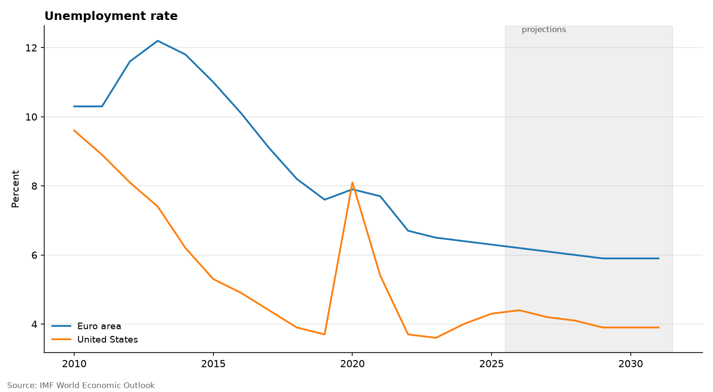

# country-data

A GitHub Copilot agent skill that fetches, tabulates and charts economic and development data
for any country or country group. It uses the free public **IMF World Economic Outlook** and
**World Bank WDI** APIs.

Ask Copilot in plain language, for example:

- "Plot inflation for the G7 since 2010"
- "GDP growth in France, Germany and the US"
- "Which emerging markets have the highest government debt?"
- "Life expectancy in Nigeria, Kenya and Ghana"

Copilot prints a table and a short summary, and saves a CSV file and a PNG chart.



*"Euro area unemployment vs the US since 2010": the shaded years are IMF projections.*

## Install

**In a repository (shared with everyone who uses Copilot there):** copy `.github/skills/country-data/`
into the repository's `.github/skills/` folder.

**Personal (Copilot CLI, every project):** copy `.github/skills/country-data/` to `~/.copilot/skills/`.

Requirements: Python 3.9+ and

```
python -m pip install -r .github/skills/country-data/scripts/requirements.txt
```

## Microsoft 365 Copilot agent (no code)

The [`m365-agent/`](m365-agent/) folder has ready-made data files and step-by-step instructions to build
a Microsoft 365 Copilot agent that charts them with Code interpreter. See
[`m365-agent/AGENT_SETUP.md`](m365-agent/AGENT_SETUP.md).

- `IMF_World_Economic_Outlook_data.xlsx`: 23 IMF WEO / Fiscal Monitor indicators, about 200 countries, 1980–2031
- `IMF_Financial_Soundness_Indicators.xlsx`: IMF core and selected additional Financial Soundness Indicators
  (incl. deposits to loans, FX loans, large exposures), quarterly, 157 countries
- `BIS_credit_to_GDP.xlsx`: BIS credit-to-GDP ratio with a one-sided Hodrick–Prescott trend
  (λ = 400,000 quarterly, 100,000 annual) and the credit-to-GDP gap, 44 economies
- `IMF_MFS_credit_to_GDP.xlsx`: the same for Gulf countries BIS doesn't cover (Kuwait, UAE, Qatar, Oman),
  from IMF Monetary and Financial Statistics credit ÷ WEO annual GDP (λ = 100,000)
- `GCC_FSI_heatmaps.xlsx`: colour-filled Excel FSI vulnerability heat maps for Kuwait, Saudi Arabia and the UAE
- `IMF_FSAP_reports_catalog.xlsx`: the 21 IMF FSAP reports for GCC countries (2001–2024) with links; with
  the report PDFs added as knowledge, the agent answers questions on FSAP findings and recommendations
- `Agent_tools.xlsx`: the agent's Python code ([`agent_tools.py`](m365-agent/agent_tools.py)): charts,
  credit-to-GDP gap from the user's own data (e.g. non-oil GDP), and an FSI vulnerability heat map based on
  each indicator's percent rank in its own history (Excel `PERCENTRANK.INC`)

## Financial soundness and credit-to-GDP gap (Python)

[`financial_data.py`](.github/skills/country-data/scripts/financial_data.py) downloads IMF FSIs and BIS
credit-to-GDP data and computes the one-sided HP trend and gap. The quarterly results match the
BIS-published credit-to-GDP gaps.

```
python .github/skills/country-data/scripts/financial_data.py credit --countries "SA,US" --out credit_gap.csv --plot gap.png
python .github/skills/country-data/scripts/financial_data.py credit --countries US --annual
python .github/skills/country-data/scripts/financial_data.py fsi --countries "KWT,SAU,ARE" --out fsi.csv
python .github/skills/country-data/scripts/financial_data.py mfs --out gulf_gap.csv --plot gulf.png
```

## Run without Copilot

```
python .github/skills/country-data/scripts/country_data.py show --what "gdp growth" --countries "France, G7" --start 2010
python .github/skills/country-data/scripts/country_data.py --help
```

## License and credits

Released under the [MIT License](LICENSE).

Inspired by [johnsonice/RA-Skills](https://github.com/johnsonice/RA-Skills). The WEO country-group
file `country_group.csv` comes from that repository and is used under its MIT license, see
[`LICENSE-country_group.txt`](.github/skills/country-data/scripts/LICENSE-country_group.txt).
Data comes from the IMF DataMapper API and the World Bank API, subject to their terms of use.
